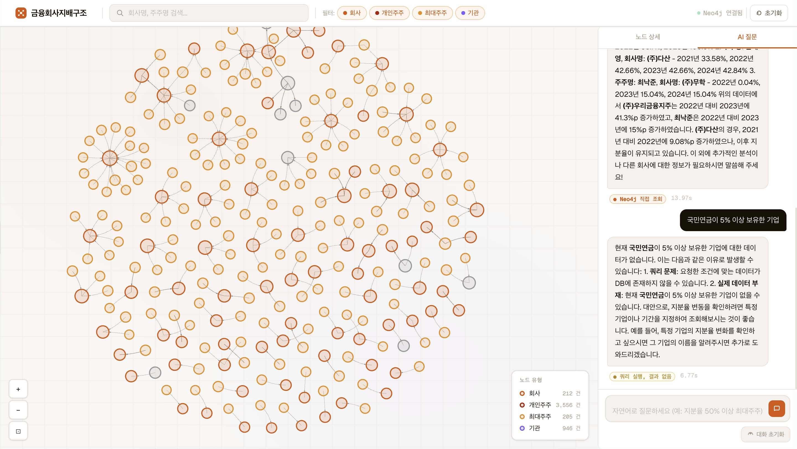

# 🕸️ [fnco-graph] 금융회사 지배구조 자연어 질의(QA) 시스템

> 금융위원회 공시 데이터를 기반으로 **금융회사 간 주주·지배 관계를 그래프로 시각화**하고, **자연어로 질의**할 수 있는 웹 애플리케이션입니다.

[](https://python.org)
[](https://fastapi.tiangolo.com)
[](https://neo4j.com)
[](https://streamlit.io)
[](https://visjs.org)

---

## 🎬 데모

[](https://bit.ly/_psych3ma_fnco-graph)
> 이미지 클릭 시 데모 영상으로 이동합니다.

---

## 💡 어떤 문제를 풀었나요?

금융회사의 지배구조 — 누가 대주주인지, 어떤 계열사가 얽혀 있는지 — 는 금융위원회 공시로 공개되어 있지만, **원시 데이터 형태라 관계를 한눈에 파악하기 어렵습니다.**

금융회사 지배구조 자연어 질의(QA) 시스템은 이 공시 데이터를 **그래프 데이터베이스(Neo4j)에 적재**하고, 인터랙티브 시각화와 자연어 채팅 인터페이스를 통해 누구나 쉽게 탐색할 수 있도록 합니다.

> "OO은행의 10% 이상 주주는 누구야?" → 채팅창에 입력하면 바로 답변

---

## 🎬 주요 기능

| 기능 | 설명 |
|------|------|
| 🗺️ 지배구조 그래프 | 금융회사·주주·계열사 관계를 인터랙티브 네트워크로 시각화 |
| 💬 자연어 질의 | 채팅창에 한국어로 질문하면 Neo4j Cypher 쿼리로 변환해 결과 반환 |
| 🔍 회사 검색 | 키워드로 노드 검색 후 해당 회사 중심의 Ego 그래프 전환 |
| 🧩 노드 상세 패널 | 특정 노드 클릭 시 지분율·임원·관계 정보 사이드 패널 표시 |
| 📊 그래프 통계 | 전체 노드·엣지 현황 및 회사 유형별 집계 |

---

## 🏗️ 아키텍처

```
공시 데이터 (금융위원회 CSV)
        │
        ▼ 전처리·적재
┌──────────────────────┐
│  Neo4j Graph DB      │  ← 회사·주주·임원 노드 + 지분·관계 엣지
└──────────┬───────────┘
           │
           ▼
┌──────────────────────┐
│  Backend API         │  ← FastAPI
│                      │
│  ┌─────────────────┐ │
│  │  Chat API       │ │  ← OpenAI LLM → Cypher 쿼리 변환 → Neo4j 실행
│  └─────────────────┘ │
│  ┌─────────────────┐ │
│  │  Graph API      │ │  ← 노드·엣지 조회, Ego 그래프, 서버 레이아웃(NetworkX)
│  └─────────────────┘ │
└──────────┬───────────┘
           │
    ┌──────┴──────┐
    ▼             ▼
┌────────┐  ┌────────────────┐
│Streamlit│  │  graph.html    │
│(채팅)   │  │  (Vis.js 그래프)│
└────────┘  └────────────────┘
```

### 설계 원칙

- **하이브리드 렌더링** — 무거운 레이아웃 계산은 서버(NetworkX/PyGraphviz)에서, 인터랙션은 클라이언트(Vis.js)에서 처리해 성능과 반응성 모두 확보
- **그래프 DB 활용** — 지분 관계처럼 깊이 있는 연결 탐색(N-hop)이 필요한 데이터를 관계형 DB 대신 Neo4j로 처리

---

## 🗂️ 프로젝트 구조

```
fnco-graph/
├── backend/                   # FastAPI 서버, Neo4j 연결, Chat·Graph API
├── frontend/                  # Streamlit 채팅 앱 + graph.html (Vis.js 시각화)
├── data/                      # 금융위원회 원시 공시 데이터
├── docs/                      # 아키텍처·변경이력·포트폴리오 문서
├── .github/workflows/         # CI 파이프라인
├── .devcontainer/             # 개발 컨테이너 설정
├── .env.example               # 환경 변수 템플릿
├── docker-compose.yml
└── Makefile                   # 주요 명령어 단축키 모음
```

---

## 🛠️ 기술 스택

| 영역 | 기술 | 선택 이유 |
|------|------|-----------|
| Graph DB | Neo4j | 지분·관계 N-hop 탐색, Cypher 쿼리 언어 |
| Backend | FastAPI | 비동기 API, 자동 Swagger 문서(/docs) |
| 서버 레이아웃 | NetworkX / PyGraphviz | 대용량 그래프 레이아웃을 서버에서 사전 계산 |
| 그래프 시각화 | Vis.js | 인터랙티브 네트워크 클라이언트 렌더링 |
| 채팅 UI | Streamlit | 자연어 채팅 인터페이스 빠른 구현 |
| NL → Cypher | OpenAI LLM | 한국어 질문을 Neo4j 쿼리로 자동 변환 |
| 컨테이너 | Docker Compose | Neo4j + API + Frontend 일괄 환경 구성 |
| CI | GitHub Actions | 자동 테스트·린트 파이프라인 |

---

## 📡 API 요약

| Method | Path | 설명 |
|--------|------|------|
| GET | `/health`, `/ping` | 서버·Neo4j 연결 상태 확인 |
| GET | `/stats` | 전체 노드·관계 현황 집계 |
| GET | `/search?q=` | 회사명 키워드 검색 |
| POST | `/chat` | 자연어 질의 → 답변 반환 |
| DELETE | `/chat` | 채팅 이력 초기화 |
| GET | `/api/v1/graph/nodes` | 전체 노드 목록 |
| GET | `/api/v1/graph/edges` | 전체 엣지 목록 |
| GET | `/api/v1/graph/nodes/{id}/ego` | 특정 노드 중심 Ego 그래프 |
| POST | `/api/v1/graph/layout` | 서버 사이드 레이아웃 계산 |

> 상세 스펙: `http://localhost:8000/docs` (Swagger UI 자동 생성)

---

## 🚀 빠른 시작

### 사전 요건
- Docker & Docker Compose
- OpenAI API 키

### Docker로 실행 (권장)

```bash
# 1. 저장소 클론
git clone https://github.com/psych3ma/fnco-graph.git
cd fnco-graph

# 2. 환경 변수 설정
make env
# .env 파일에 NEO4J_URI, NEO4J_PASSWORD, OPENAI_API_KEY 입력

# 3. 실행
make up
```

### 로컬 실행

```bash
make install

# 터미널 1
make run-be    # FastAPI 백엔드

# 터미널 2
make run-fe    # Streamlit 프론트

# 그래프 UI만 (백엔드 별도 실행 필요)
make serve-graph   # → http://localhost:8080/graph.html
```

| 서비스 | 주소 |
|--------|------|
| 지배구조 그래프 UI | http://localhost:8080/graph.html |
| Streamlit 채팅 | http://localhost:8501 |
| API 문서 (Swagger) | http://localhost:8000/docs |

### 테스트

```bash
make test
```

---

## 📐 상세 문서

- [`docs/PYGRAPHVIZ-VISJS-HYBRID.md`](docs/PYGRAPHVIZ-VISJS-HYBRID.md) — 서버/클라이언트 하이브리드 렌더링 설계
- [`docs/CHANGELOG.md`](docs/CHANGELOG.md) — 변경 이력
- [`docs/CTO-PORTFOLIO-REVIEW.md`](docs/CTO-PORTFOLIO-REVIEW.md) — 기술 검토 노트

---

## 🔒 환경 변수

`.env.example`을 복사해 `.env`로 사용하세요. `.env`는 `.gitignore`에 포함되어 저장소에 올라가지 않습니다.

```
NEO4J_URI=bolt://localhost:7687
NEO4J_USER=neo4j
NEO4J_PASSWORD=your-password
OPENAI_API_KEY=sk-...
```

---

## 📝 개발 배경

금융회사 지배구조 공시 데이터는 공개되어 있지만 CSV·표 형태라 관계 파악이 직관적이지 않습니다.  
"그래프 데이터베이스에 넣으면 구조가 보이지 않을까?"라는 질문에서 시작했습니다.  
자연어로 질문하면 그래프 쿼리로 번역하는 LLM 레이어를 추가하면서, **도메인 전문 지식 없이도 금융 지배구조를 탐색**할 수 있는 도구로 발전시켰습니다.

---

<div align="center">
  <sub>데이터 출처: 금융위원회 금융회사지배구조정보 공시 · Made with Cursor AI</sub>
</div>
